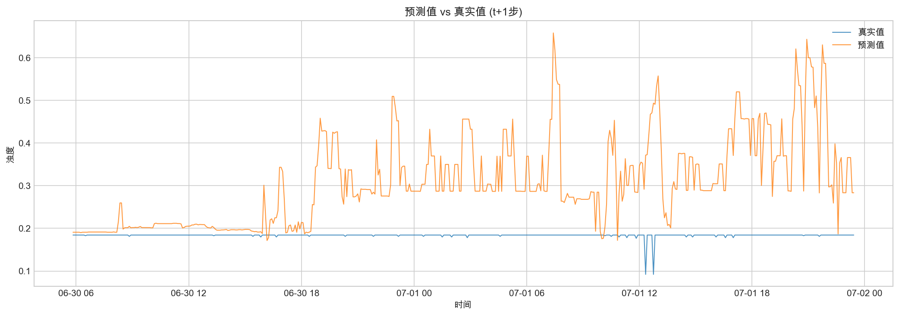
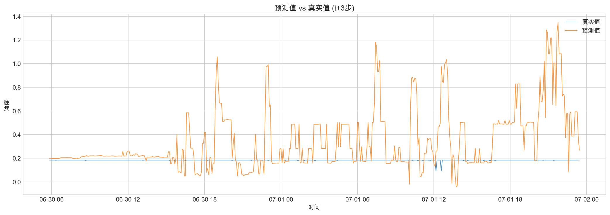
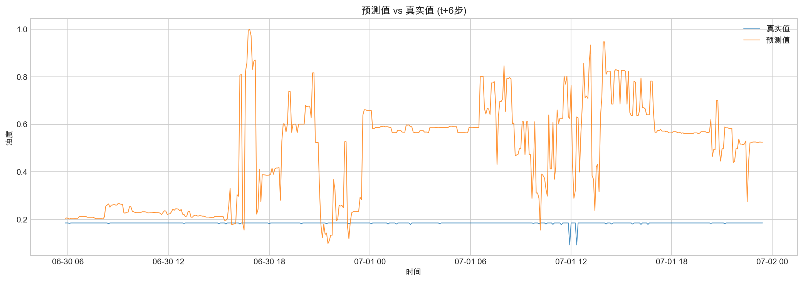
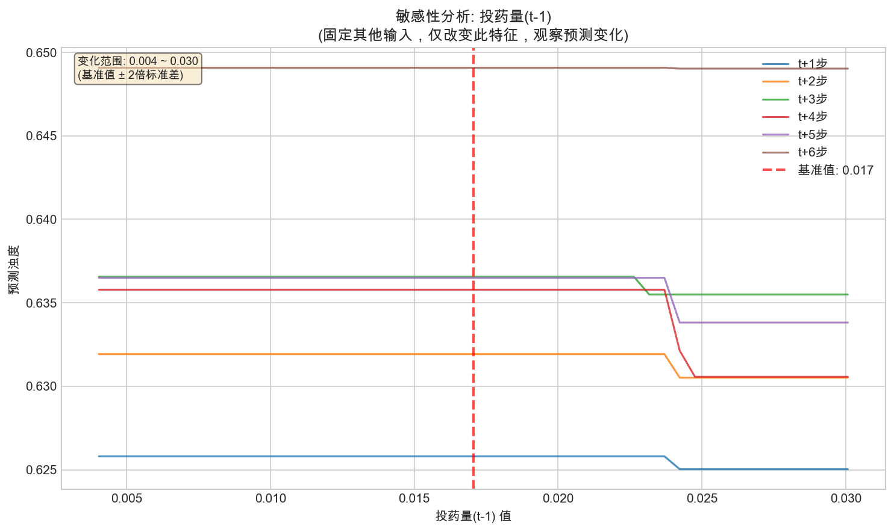
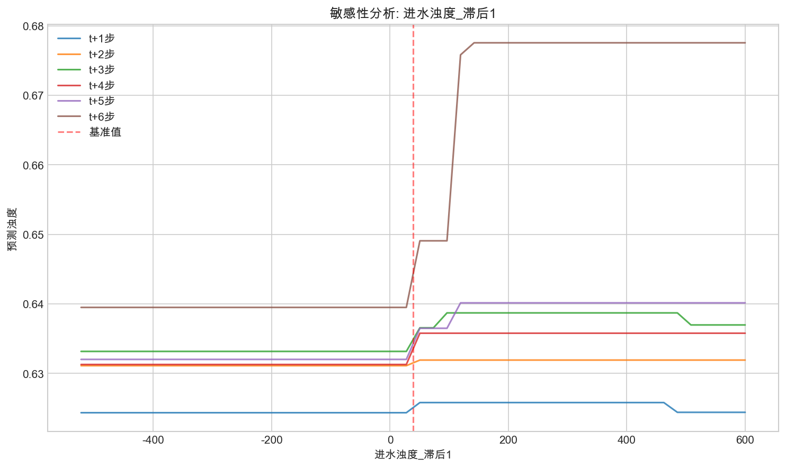
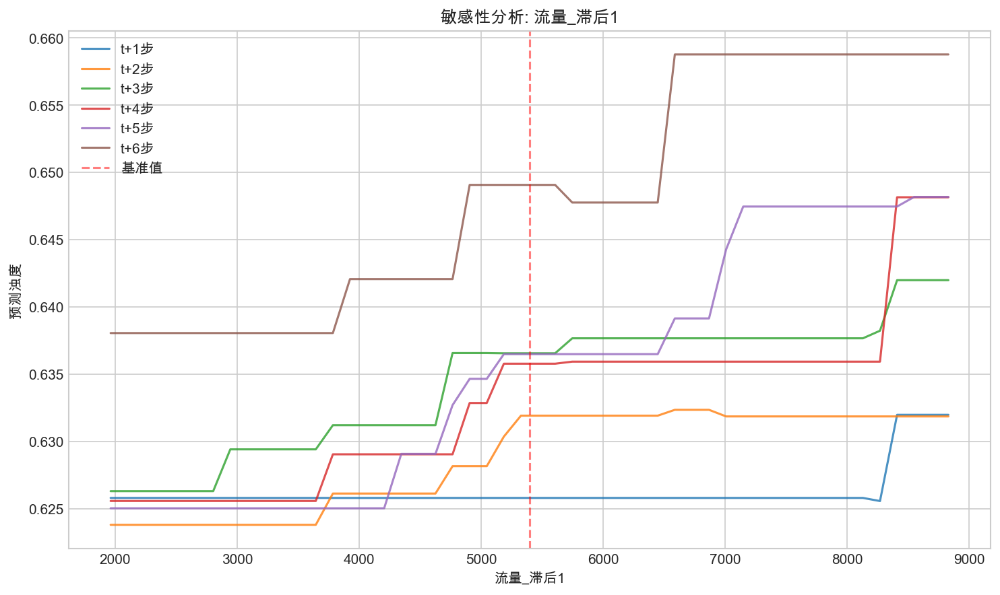

# 出水浊度预测模型 - 分析报告

> 生成时间: 2026-02-05 11:16

## 1. 模型概述

| 项目 | 值 |
|------|-----|
| 最佳模型 | **LightGBM** |
| 测试集 R² | **0.8055** |
| 特征数量 | 126 |
| 预测步数 | 6 步 |

---

## 2. 预测性能分析

### 2.1 预测值 vs 真实值

模型在测试集上的预测效果对比：

| t+1 步预测 | t+3 步预测 | t+6 步预测 |
|:---:|:---:|:---:|
|  |  |  |

**分析：**
- 短期预测（t+1）拟合效果最好，能够较好地跟踪真实值变化
- 随着预测步数增加，预测精度逐渐下降
- 在数据波动较大的时段，预测偏差也相应增大

### 2.2 R² 分数衰减

**分析：**
- t+1 步 R²: **0.8769**
- t+6 步 R²: **0.7578**
- 整体衰减幅度约 13.6%

### 2.3 残差分布

**分析：**
- 残差分布近似正态，说明模型无明显系统性偏差
- 各步预测的残差均值接近 0

---

## 3. 特征重要性分析

### 3.1 Top 20 特征重要性

**Top 10 重要特征：**

| 排名 | 特征 | 重要性 |
|:---:|------|-------:|
| 1 | 出水浊度_滞后1 | 321.0000 |
| 2 | 出水浊度_滚动12标准差 | 111.3333 |
| 3 | 出水浊度_滚动3标准差 | 107.0000 |
| 4 | 出水浊度_滚动6标准差 | 63.6667 |
| 5 | 出水浊度_滚动3均值 | 54.8333 |
| 6 | 投药量_滚动12标准差 | 53.1667 |
| 7 | 进水浊度_滞后12 | 51.0000 |
| 8 | 进水浊度_滚动12标准差 | 50.3333 |
| 9 | 进水浊度_滞后1 | 48.0000 |
| 10 | 水面温度_滚动12标准差 | 42.8333 |

### 3.2 按原始变量分组

**分析：**
- **出水浊度历史值**对预测影响最大，体现了时序数据的自相关性
- **进水浊度**是第二重要因素，反映了进出水的因果关系
- **投药量**的影响体现了控制变量对出水质量的调节作用

### 3.3 滞后效应分析

分析不同时间滞后对预测的影响：

| 进水浊度 | 投药量 | 出水浊度 |
|:---:|:---:|:---:|
|  |  |  |

**数据挖掘洞察：**
- 若某滞后步数重要性较高，说明该时间点的数据对当前预测有重要影响
- 例如：滞后 6 步（约 30 分钟）的进水浊度重要性高 → 水力停留时间约 30 分钟

---

## 4. 敏感性分析

分析输入变化对预测结果的影响：

| 投药量 | 进水浊度 | 流量 |
|:---:|:---:|:---:|
|  |  |  |

**分析：**
- 曲线斜率反映了输入变化对输出的影响程度
- 可用于指导投药优化：预测"增加/减少投药量 X 单位，出水浊度变化多少"

---

## 5. 结论与建议

### 5.1 模型性能

- 模型整体 R² 达到 **0.8055**，预测效果良好
- 短期预测（t+1 ~ t+3）精度较高，适合实时预警
- 长期预测（t+4 ~ t+6）精度有所下降，可用于趋势判断

### 5.2 数据洞察

1. **时序自相关**：出水浊度历史值是最重要的预测因子
2. **因果关系**：进水浊度约 30 分钟后影响出水浊度（根据滞后分析）
3. **控制效果**：投药量对出水浊度有调节作用

### 5.3 应用建议

- **实时预测**：使用 t+1 ~ t+3 步预测进行实时监控和预警
- **投药优化**：结合敏感性分析，优化投药策略
- **异常检测**：当预测残差超过阈值时，可触发异常告警
