# 出水浊度预测模型 - 分析报告

> 生成时间: 2026-02-05 12:10

## 1. 模型概述

| 项目 | 值 |
|------|-----|
| 最佳模型 | **LightGBM** |
| 测试集 R² | **0.8055** |
| 特征数量 | 126 |
| 预测步数 | 6 步 |

---

## 2. 预测性能分析

### 2.1 预测值 vs 真实值（典型示例）

从测试集中选取了 3 个典型时间窗口，展示模型的预测效果：

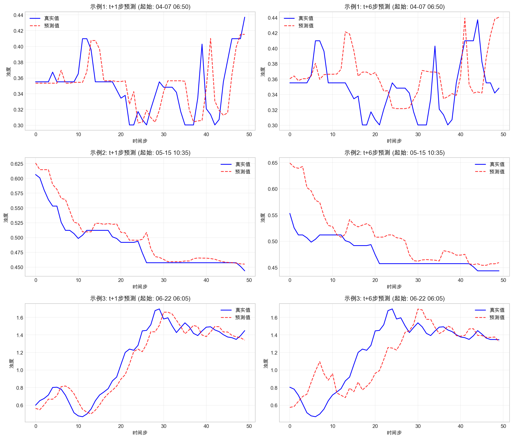

**说明：**
- 蓝色实线：真实值
- 红色虚线：预测值
- 每行展示一个时间窗口，分别来自测试集的开始、中间和结束时段

### 2.2 R² 分数衰减

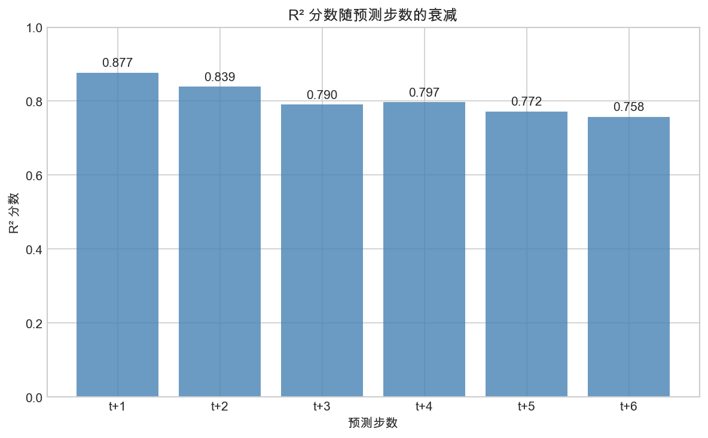

**分析：**
- t+1 步 R²: **0.8769**
- t+6 步 R²: **0.7578**
- 整体衰减幅度约 13.6%

### 2.3 残差分布

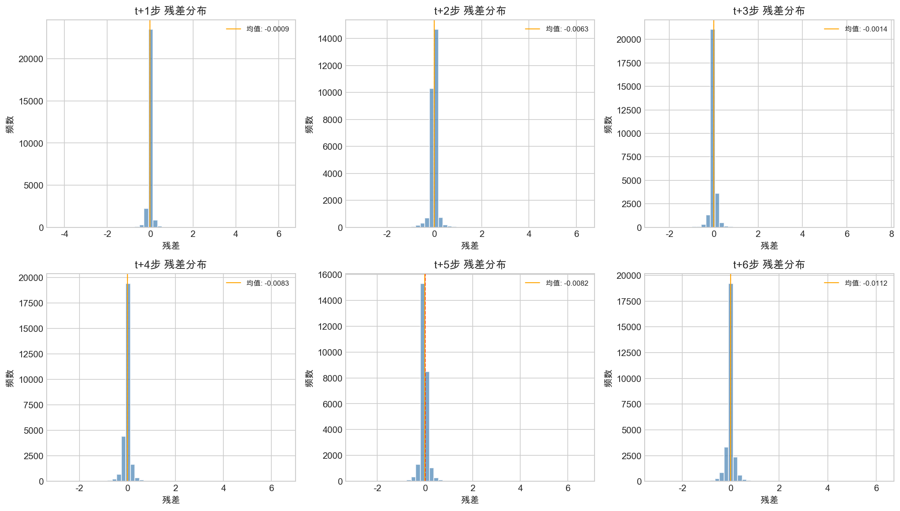

**说明：**
- 残差 = 真实值 - 预测值
- 残差接近 0 表示预测准确
- 红色虚线为零线，橙色线为残差均值

---

## 3. 特征重要性分析

### 3.1 什么是滞后特征？

**滞后特征 (t-N)** 表示使用 **N 个时间步之前**的历史数据作为输入。

例如：
- `出水浊度(t-1)`：上一个时间点的出水浊度值
- `进水浊度(t-6)`：6 个时间步之前的进水浊度值（约 30 分钟前）

**为什么需要滞后特征？**
水处理过程存在时间延迟，当前的进水浊度需要经过一段时间才能影响出水浊度。通过分析不同滞后的重要性，可以推断出这个延迟时间。

### 3.2 Top 20 特征重要性

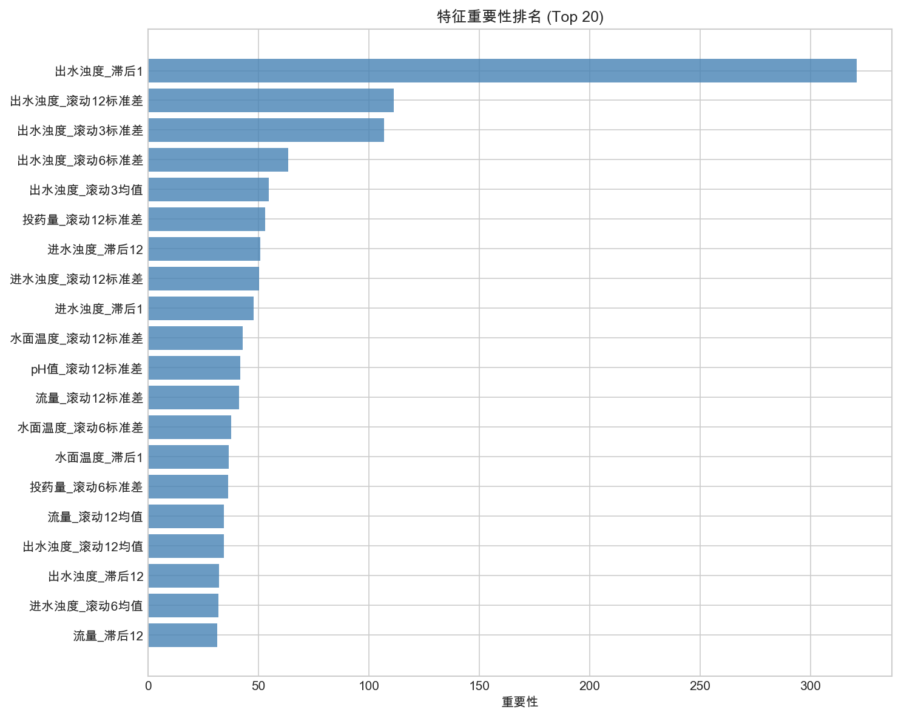

**Top 10 重要特征：**

| 排名 | 特征 | 重要性 |
|:---:|------|-------:|
| 1 | 出水浊度(t-1) | 321.0000 |
| 2 | 出水浊度_滚动12标准差 | 111.3333 |
| 3 | 出水浊度_滚动3标准差 | 107.0000 |
| 4 | 出水浊度_滚动6标准差 | 63.6667 |
| 5 | 出水浊度_滚动3均值 | 54.8333 |
| 6 | 投药量_滚动12标准差 | 53.1667 |
| 7 | 进水浊度(t-12) | 51.0000 |
| 8 | 进水浊度_滚动12标准差 | 50.3333 |
| 9 | 进水浊度(t-1) | 48.0000 |
| 10 | 水面温度_滚动12标准差 | 42.8333 |

### 3.3 按原始变量分组

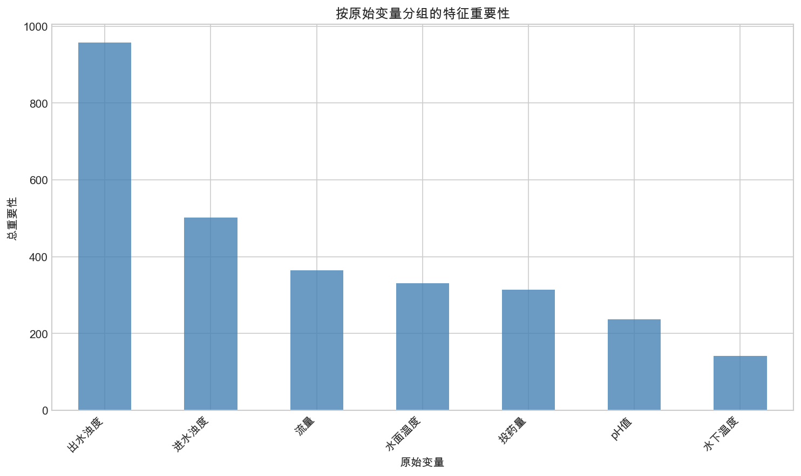

**分析：**
- **出水浊度历史值**对预测影响最大，体现了时序数据的自相关性
- **进水浊度**是第二重要因素，反映了进出水的因果关系
- **投药量**的影响体现了控制变量对出水质量的调节作用

### 3.4 滞后效应分析

分析不同时间点的历史输入对预测的影响程度：

| 进水浊度 | 投药量 | 出水浊度 |
|:---:|:---:|:---:|
| 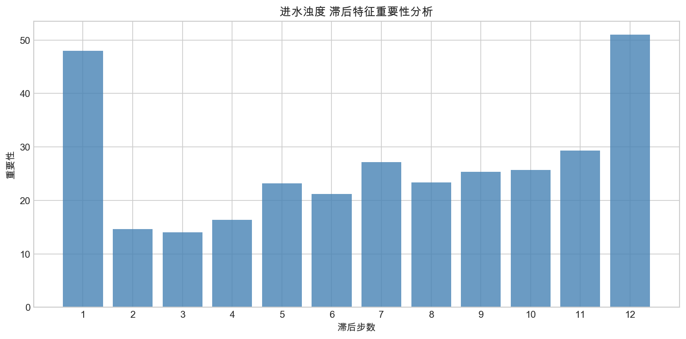 | 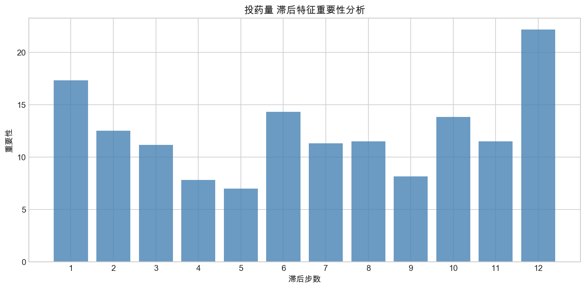 | 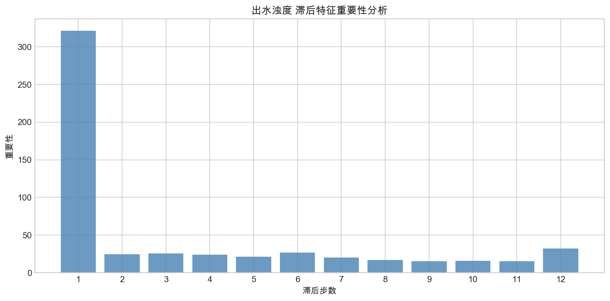 |

**如何解读？**
- 横坐标 `t-N` 表示 N 个时间步之前的数据
- 柱子越高，表示该时间点的历史数据对预测越重要
- 例如：如果 t-6 的进水浊度重要性高，说明进水约 30 分钟后影响出水

---

## 4. 敏感性分析

### 4.1 什么是敏感性分析？

敏感性分析用于回答：**如果某个输入变化，模型预测会如何变化？**

**方法：**
1. 固定其他所有输入特征不变
2. 仅改变目标特征的值（在基准值 ± 2倍标准差范围内变化）
3. 观察模型预测输出如何随之变化

### 4.2 各变量敏感性（t-12 到 t-1）

每个变量的所有历史时刻输入的敏感性分析：

**投药量敏感性：**
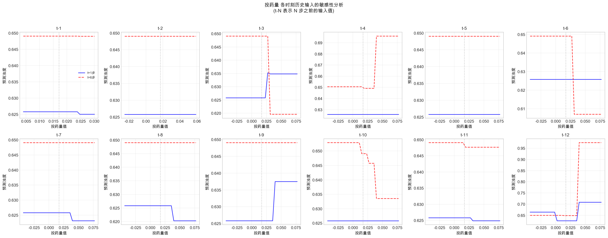

**进水浊度敏感性：**
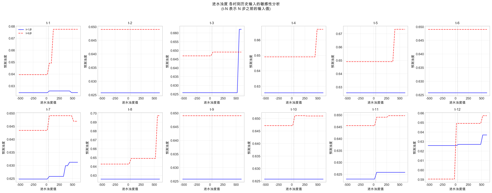

**流量敏感性：**
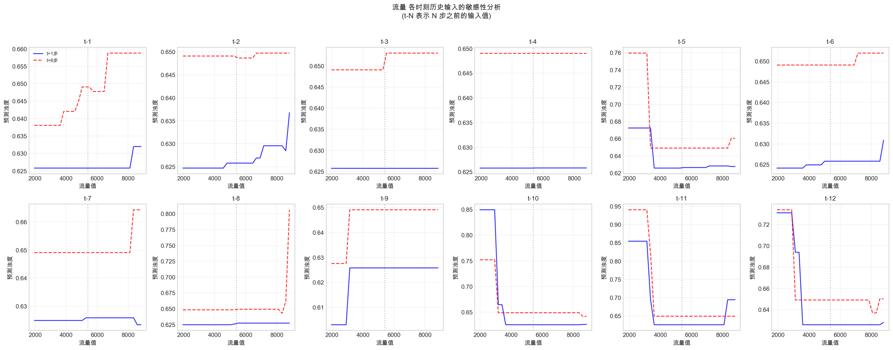

**如何解读？**
- 每个子图对应一个历史时刻 (t-1 到 t-12)
- 蓝色实线：t+1 步预测，红色虚线：t+6 步预测
- 曲线斜率越陡，表示该历史输入对预测影响越大
- 可用于评估"增加/减少某时刻的投药量 X 单位，出水浊度大约变化多少"

---

## 5. 结论与建议

### 5.1 模型性能

- 模型整体 R² 达到 **0.8055**，预测效果良好
- 短期预测（t+1 ~ t+3）精度较高，适合实时预警
- 长期预测（t+4 ~ t+6）可用于趋势判断

### 5.2 数据洞察

1. **时序自相关**：出水浊度历史值是最重要的预测因子
2. **因果关系**：进水浊度经过一定时间延迟后影响出水浊度
3. **控制效果**：投药量对出水浊度有调节作用

### 5.3 应用建议

- **实时预测**：使用 t+1 ~ t+3 步预测进行实时监控和预警
- **投药优化**：结合敏感性分析，优化投药策略
- **异常检测**：当预测残差超过阈值时，可触发异常告警
