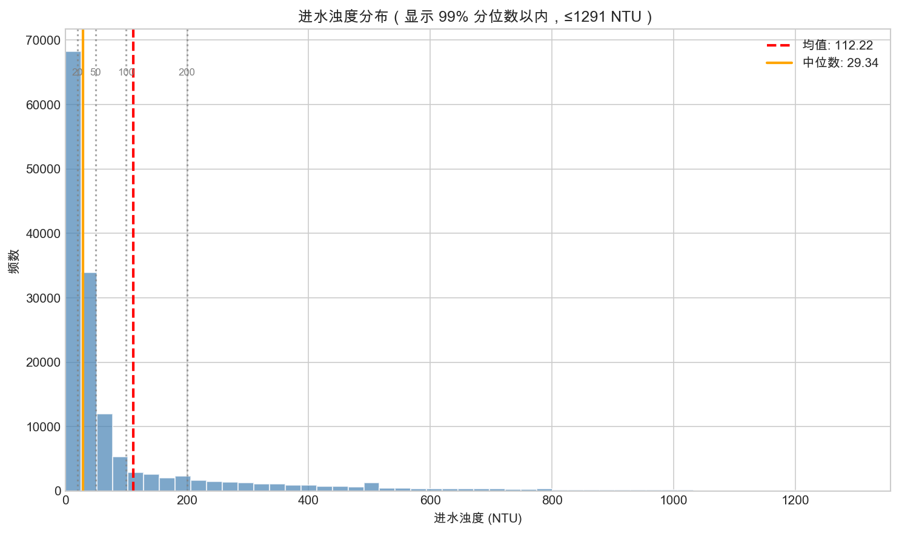
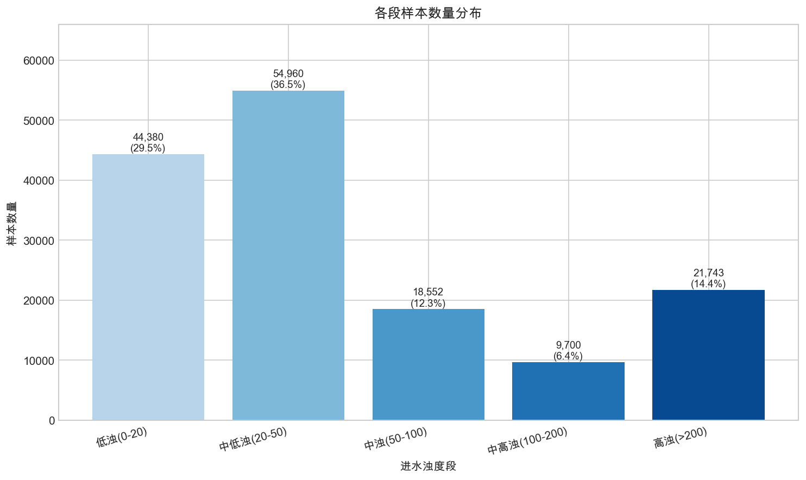
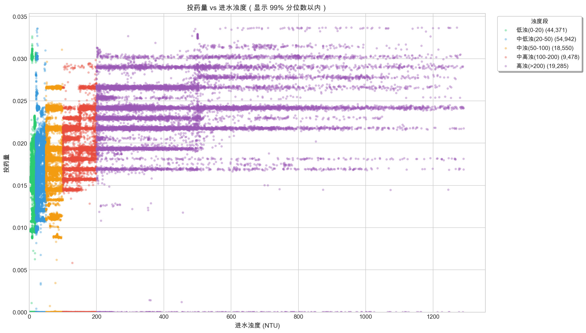
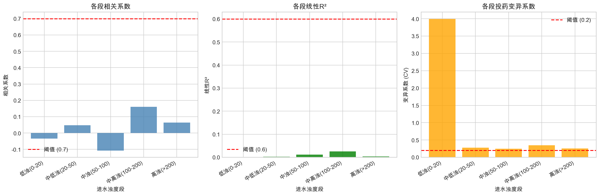
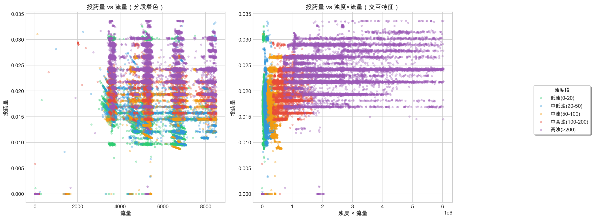
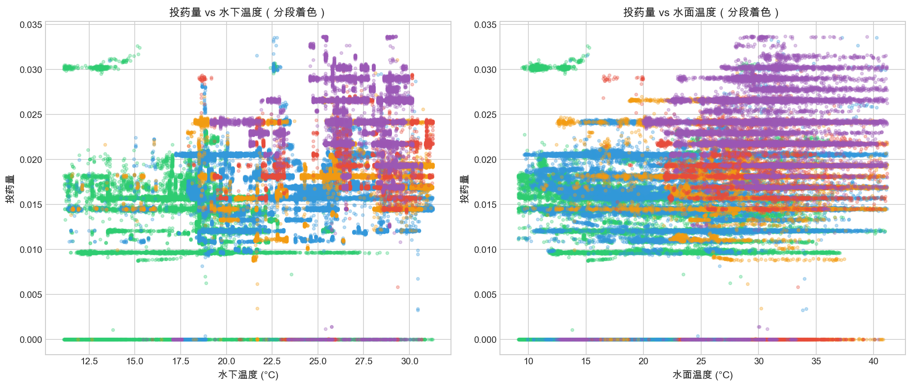

# 次氯酸钠投加量分段分析报告

> 生成时间: 2026-02-06 10:02

## 1. 数据概览

| 项目 | 值 |
|------|-----|
| 总样本数 | 150,539 |
| 进水浊度范围 | 0.000 ~ 1999.297 NTU |
| 进水浊度均值 | 112.218 NTU |
| 投药量范围 | 0.000 ~ 6.170 |
| 投药量均值 | 0.016 |

**进水浊度分位数：**
- p10: 10.898 NTU
- p25: 18.442 NTU
- p50: 29.336 NTU
- p75: 72.398 NTU
- p90: 314.181 NTU
- p95: 526.223 NTU
- p99: 1291.404 NTU

---

## 2. 进水浊度分布

**分析：**
- 数据表明进水浊度呈现特定分布特征
- 灰色虚线为分段阈值

---

## 3. 分段统计

**各段样本量：**

| 浊度段 | 样本数 | 占比 |
|-------|-------|------|
| 低浊(0-20) | 44,380 | 29.5% |
| 中低浊(20-50) | 54,960 | 36.5% |
| 中浊(50-100) | 18,552 | 12.3% |
| 中高浊(100-200) | 9,700 | 6.4% |
| 高浊(>200) | 21,743 | 14.4% |

---

## 4. 投药量 vs 进水浊度关系

**分析：**
- 不同颜色代表不同的浊度分段
- 可观察各段内投药量与浊度的关系模式

---

## 5. 关系明确性分析

**指标说明：**
- **相关系数**：衡量投药量与浊度的线性相关强度（> 0.7 为高相关）
- **线性R²**：线性模型拟合优度（> 0.6 表示线性关系明确）
- **变异系数 (CV)**：投药量的相对波动程度（< 0.2 表示投药稳定）

---

## 6. 多特征分析

### 6.1 流量与投药量关系

**分析：**
- 左图：投药量 vs 流量，不同颜色表示不同浊度段
- 右图：投药量 vs 浊度×流量（交互特征），探索组合效应

### 6.2 水温与投药量关系

**分析：**
- 水温可能影响药剂反应速率
- 低温时可能需要增加投药量

---

## 7. 决策表格

根据分析结果，各段建议使用的建模方法：

| 浊度段 | 样本量 | 相关系数 | 线性R² | 变异系数 | 推荐方法 |
|-------|-------|---------|-------|---------|---------|
| 低浊(0-20) | 44,380 | -0.034 | 0.001 | 3.994 | 机理模型（低浊工况，投药规律简单） |
| 中低浊(20-50) | 54,960 | 0.048 | 0.002 | 0.278 | 数据驱动（样本充足，适合机器学习） |
| 中浊(50-100) | 18,552 | -0.108 | 0.012 | 0.245 | 数据驱动（样本充足，适合机器学习） |
| 中高浊(100-200) | 9,700 | 0.161 | 0.026 | 0.350 | 混合方法（数据驱动 + 机理约束） |
| 高浊(>200) | 21,743 | 0.065 | 0.004 | 0.260 | 机理模型 + 安全约束（极端工况） |

---

## 8. 决策逻辑说明

### 什么时候用数据驱动？
- 样本量充足（> 1000）
- 关系复杂，难以用简单公式描述
- 存在非线性或交互效应

### 什么时候用机理模型？
- 样本量少但关系明确（线性R² > 0.6）
- 投药行为稳定（CV < 0.2）
- 有明确的物理/化学原理支撑

### 什么时候需要烧杯实验？
- 样本量不足
- 关系不明确（低相关、低R²）
- 极端工况下的安全验证

---

## 9. 后续建议

1. **低浊段（机理模型）**：建立基于浊度的简单线性投药公式
2. **中低/中浊段（数据驱动）**：使用 RandomForest、LightGBM 等机器学习模型
3. **中高浊段（混合方法）**：数据驱动 + 机理约束（设置上下限）
4. **高浊段（机理+安全约束）**：使用专家规则，确保安全投药量
